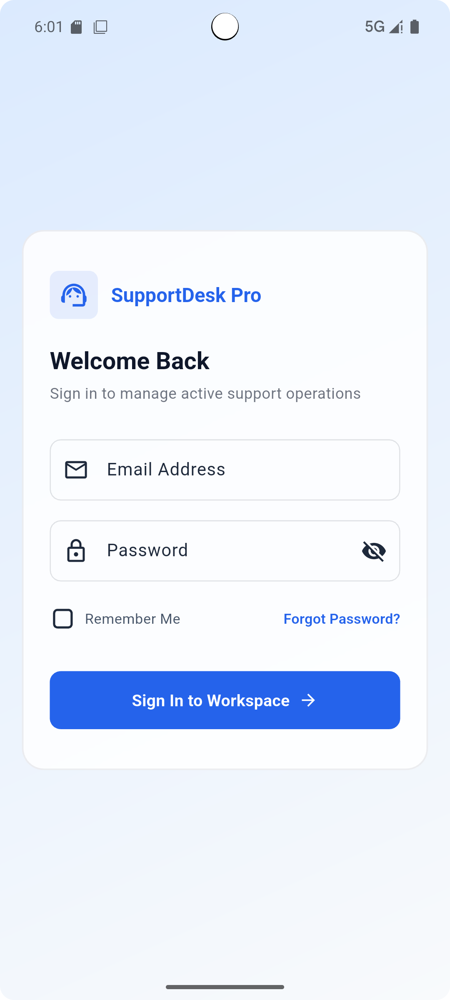
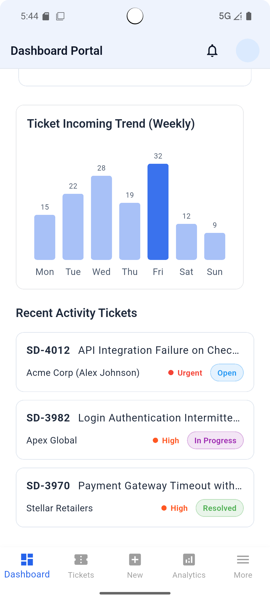
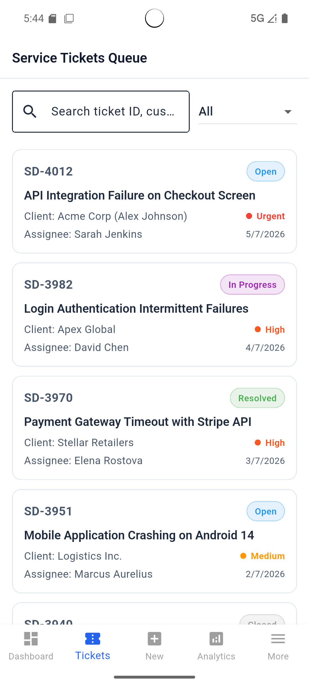
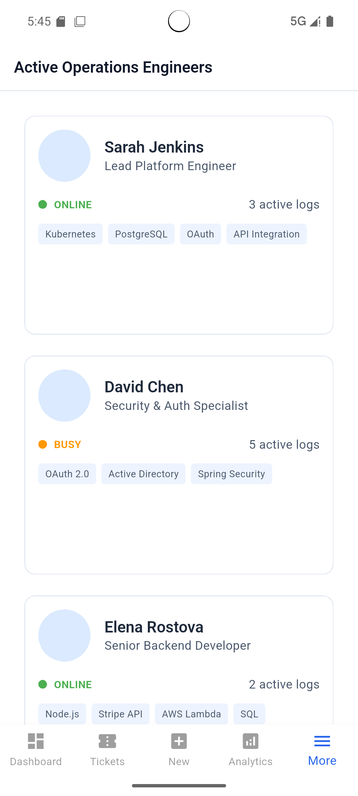

# 🎫 SupportDesk Pro

A modern Technical Support Ticket Management System UI built with Flutter and Material 3.


## 📌 Overview

SupportDesk Pro is a professional Help Desk and Technical Support Ticket Management System designed for support engineers and customer support teams.

The application demonstrates modern Flutter architecture, responsive UI design, reusable components, dashboard analytics, and enterprise-level application structure.

---

## ✨ Features

### 📊 Dashboard
- Ticket Analytics
- Recent Activities
- KPI Cards
- Support Metrics
- Quick Actions

### 🎫 Ticket Management
- Ticket Listing
- Ticket Details
- Status Tracking
- Priority Badges
- Comments Section

### 👥 Team Management
- Team Members
- Availability Status
- Skills Overview
- Assigned Tickets

### 📚 Knowledge Base
- Search Articles
- Categories
- FAQs
- Popular Resources

### 🔔 Notifications
- Read/Unread Notifications
- Priority Alerts

### ⚙️ Settings
- Theme Configuration
- Notification Preferences
- Account Settings

---

## 🏗️ Project Structure

```text
lib/
├── core/
├── models/
├── data/
├── themes/
├── widgets/
├── screens/
└── main.dart
```

---

## 🛠️ Tech Stack

- Flutter
- Dart
- Material 3
- Responsive Design
- Clean Architecture
- Reusable Widgets
- Static Dummy Data

---

## 📱 Screenshots

### Login Screen



### Dashboard



### Ticket Management



### Analytics


### Team Screen



---

## 🚀 Getting Started

Clone the repository:

```bash
git clone https://github.com/itsmevikrampratap/supportdesk-pro.git
```

Navigate to the project:

```bash
cd supportdesk-pro
```

Install dependencies:

```bash
flutter pub get
```

Run the application:

```bash
flutter run
```

---

## 👨‍💻 Author

### Vikram Pratap Singh

Flutter Developer | Technical Support Specialist | API Integration & Troubleshooting | Linux Administration Learner | AI Enthusiast

GitHub:
https://github.com/itsmevikrampratap

---

## ⭐ Support

If you like this project, consider giving it a star ⭐